<h1 align="center" style="color: red;">Desafio_ProjetosUdemy_UNES</h1>
<h2>Irei refazer o site fictício UNES(criado em curso da UDEMY) usando apenas JS e CSS</h2>

Aviso: Esse desafio não tem como objetivo recriar o projeto UNES para ser considerado melhor que o projeto original

Objetivo: Apenas me desafia e praticar algumas das tecnologias técnicas que estudei e estou estudando no momento

     <h3 align="center">Imagens do projeto original acessado em um desktop<h3>
     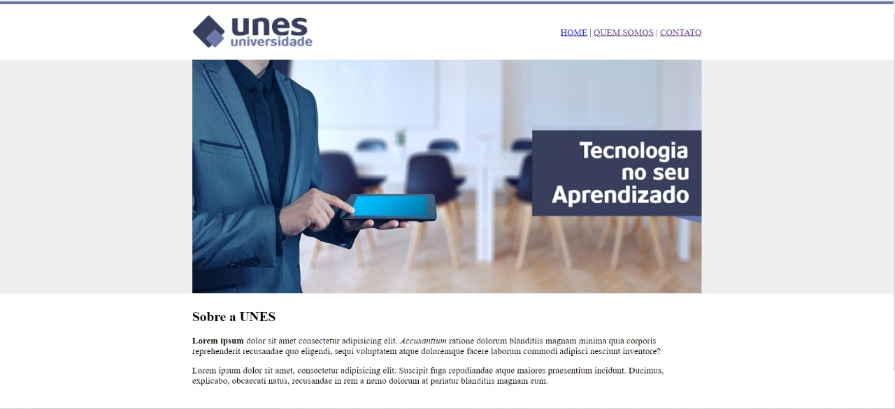
     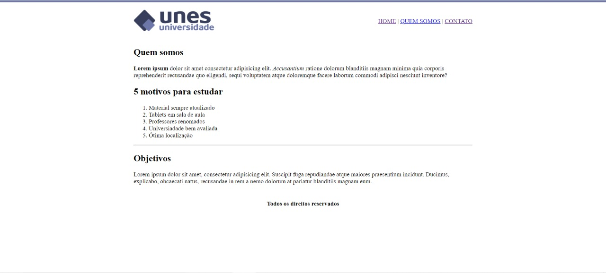
     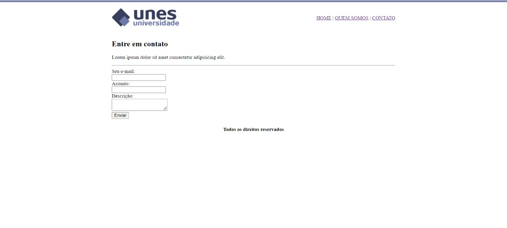

      

     <h3 align="center">Imagens do projeto editado acessado em um desktop<h3>
     Confesso que a página inicial não sofreu tanta mudança
     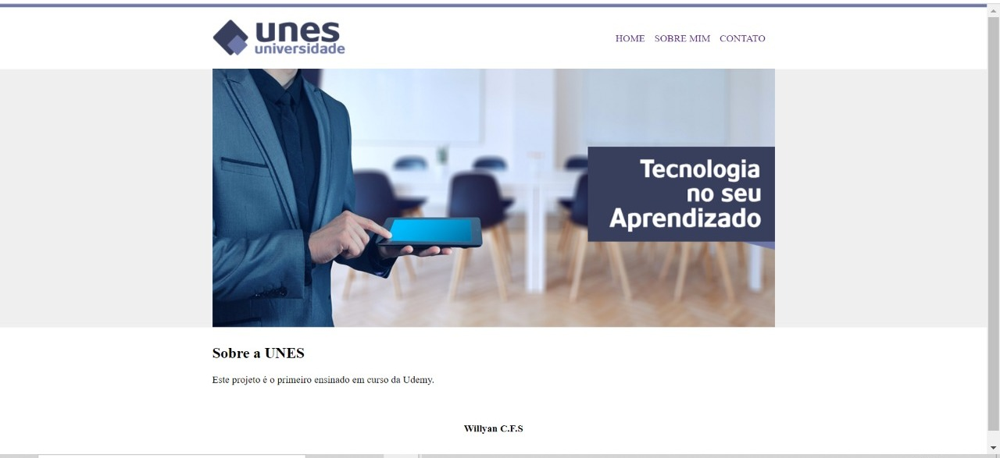
     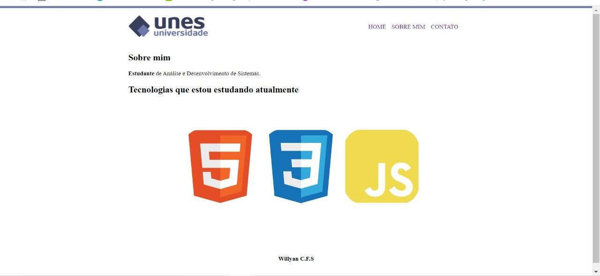
     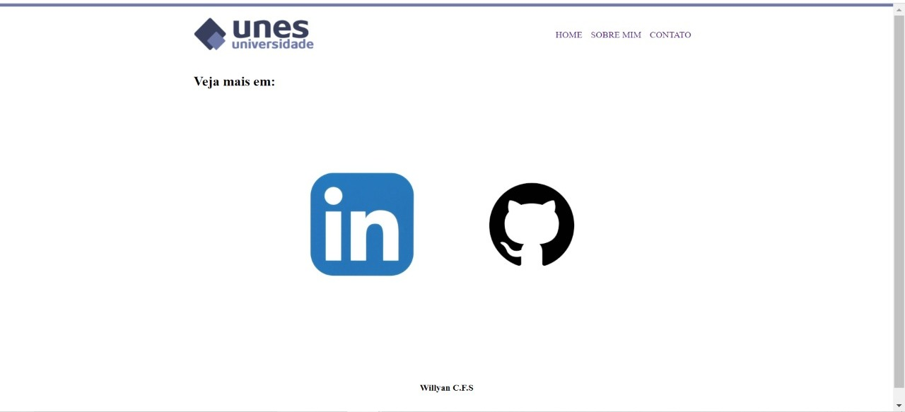

      

     <h3 align="center">Imagens do projeto editado acessado em um dispositivo móvelh3>
     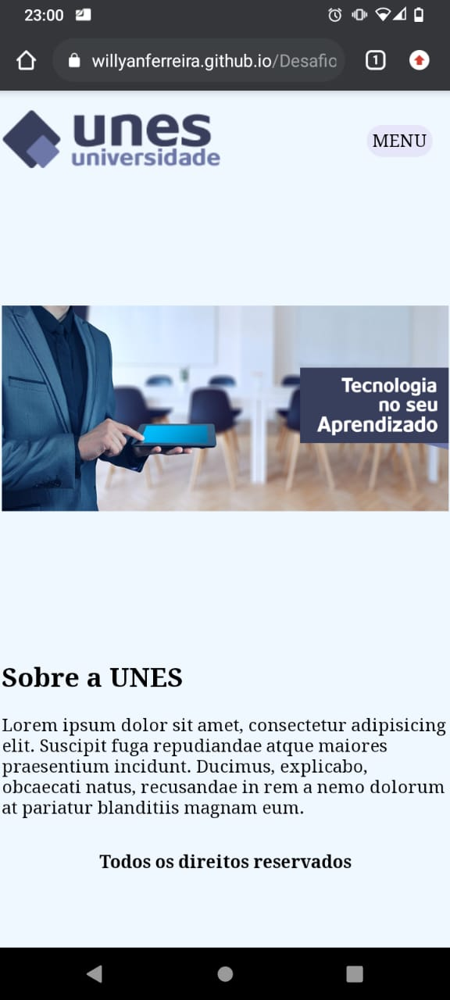
     

         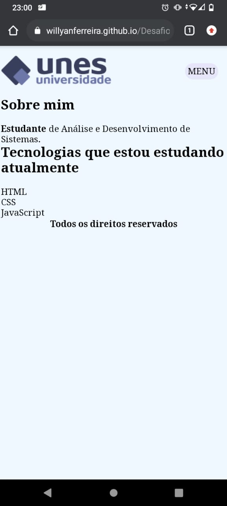
         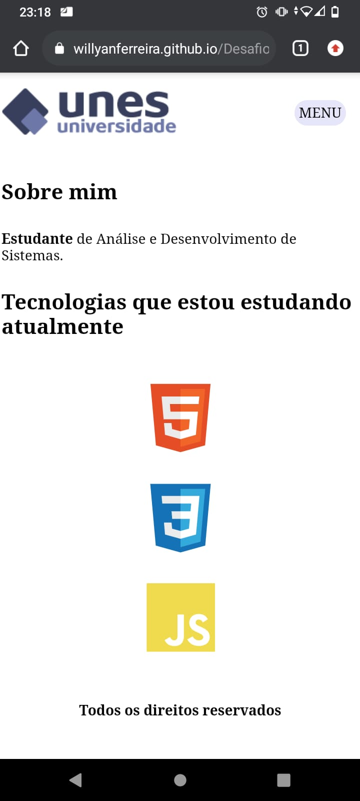
     

     

         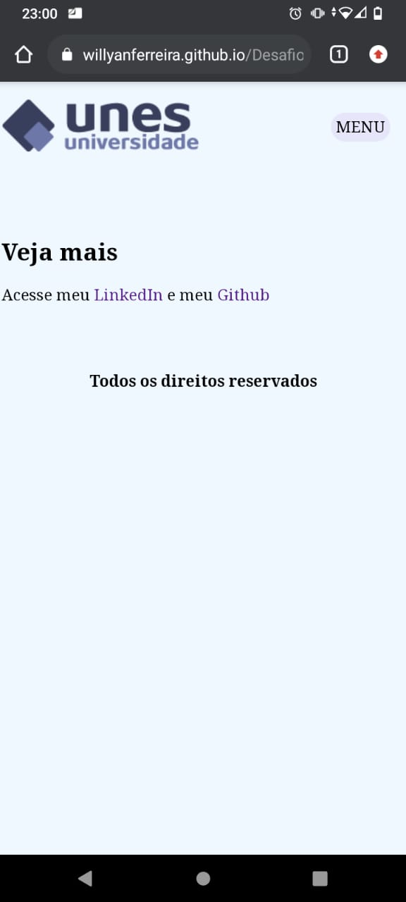
         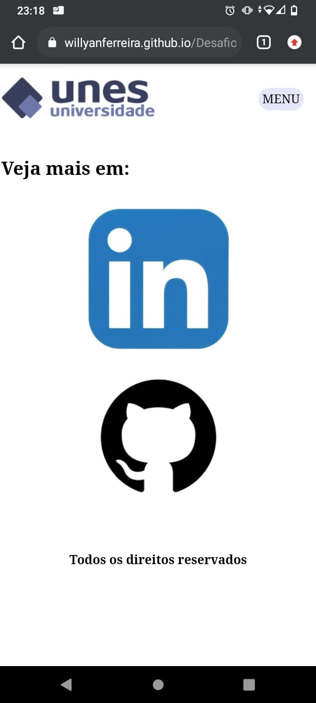
     

